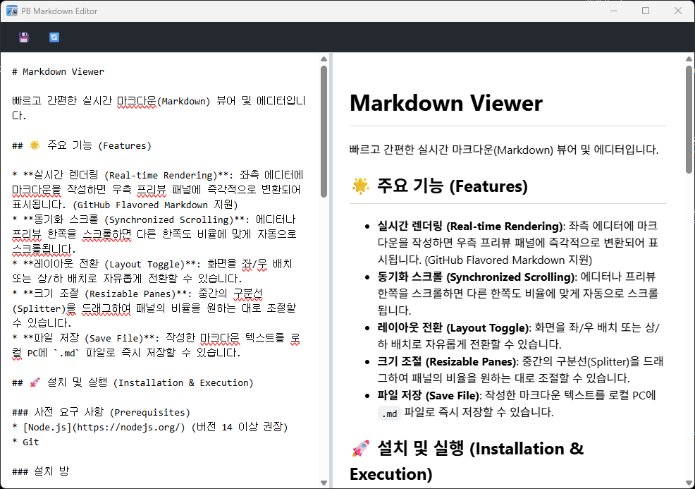

#  PB Markdown Editor



빠르고 간편한 실시간 마크다운(Markdown) 에디터입니다.

## 🌟 주요 기능 (Features)

* **실시간 렌더링 (Real-time Rendering)**: 좌측 에디터에 마크다운을 작성하면 우측 프리뷰 패널에 즉각적으로 변환되어 표시됩니다. (GitHub Flavored Markdown 지원)
* **파일 즉시 열기 (.md 연결 및 Drag & Drop)**: 윈도우 환경에서 `.md` 파일을 더블클릭하거나, 화면 안에 파일을 끌어다 놓으면 즉시 에디터에 로드됩니다.
* **동기화 스크롤 (Synchronized Scrolling)**: 에디터나 프리뷰 한쪽을 스크롤하면 다른 한쪽도 비율에 맞게 자동으로 스크롤됩니다.
* **레이아웃 전환 (Layout Toggle)**: 화면을 좌/우 배치 또는 상/하 배치로 자유롭게 전환할 수 있습니다.
* **크기 조절 (Resizable Panes)**: 중간의 구분선(Splitter)을 드래그하여 패널의 비율을 원하는 대로 조절할 수 있습니다.
* **파일 저장 (Save File)**: 작성한 마크다운 텍스트를 로컬 PC에 `.md` 파일로 즉시 저장할 수 있습니다.

## 🚀 설치 및 실행 (Installation & Execution)

### 사전 요구 사항 (Prerequisites)
* [Node.js](https://nodejs.org/) (버전 14 이상 권장)
* Git

### 설치 방법

1. 저장소를 클론(Clone)하거나 다운로드합니다.
```bash
git clone https://github.com/PEANUTBUTTER1001/pb-markdown-editor
cd pb-markdown-editor
```

2. 필요한 패키지를 설치합니다.
```bash
npm install
```

### 🚀 실행 및 빌드 방법 (3가지 방식)

사용 목적에 따라 3가지 방법으로 앱을 실행하거나 빌드할 수 있습니다.

#### 1. 개발자 모드 실행 (빠른 테스트용)
소스코드를 직접 수정하고 즉시 테스트해볼 때 사용합니다.
```bash 
npm install
npm start
```
* `npm start`를 입력하면 자동으로 코드가 번들링(`esbuild`)된 후 앱이 실행됩니다.

#### 2. 설치형(Installer) 빌드 (추천 - 가장 빠른 실행 속도)
사용자 PC에 정식으로 설치하는 방식입니다. 초기 실행 속도가 매우 빠릅니다.
```bash
npm run build:installer
```
* 빌드가 완료되면 `dist/` 폴더 내에 `PB Markdown Editor Setup 1.0.0.exe` 형태의 설치 파일이 생성됩니다.
* 이 파일을 배포하여 사용자가 설치하게 하면, 이후 바탕화면 아이콘 클릭 시 즉시 켜지는 극강의 로딩 속도를 제공합니다.

#### 3. 단일 실행 파일(Portable) 빌드 (무설치 버전)
설치 과정 없이 파일 하나만 들고 다니며 즉시 실행하고 싶을 때 사용합니다.
```bash
npm run build:portable
```
* 빌드가 완료되면 `dist/` 폴더 내에 `PB Markdown Editor 1.0.0.exe` 파일이 생성됩니다.
* 실행 시 매번 임시 폴더에 압축을 푸는 과정이 있어 설치형에 비해 초기 로딩 시간이 몇 초 정도 더 걸립니다.

## 💻 사용법 (Usage)

1. 프로그램이 실행되면 화면 좌측(또는 상단)의 텍스트 에디터 창에 마크다운 문법으로 글을 작성합니다.
2. 실시간으로 우측(또는 하단)에 결과가 렌더링됩니다.
3. 상단의 **🔄 (레이아웃 전환)** 버튼을 클릭하면 패널 배치를 변경할 수 있습니다.
4. 패널 사이의 경계선을 드래그하면 에디터와 프리뷰 영역의 크기를 조절할 수 있습니다.
5. 작성을 완료한 후 상단의 **💾 (저장)** 버튼을 누르면 원하는 위치에 `.md` 형식으로 파일을 저장할 수 있습니다.
